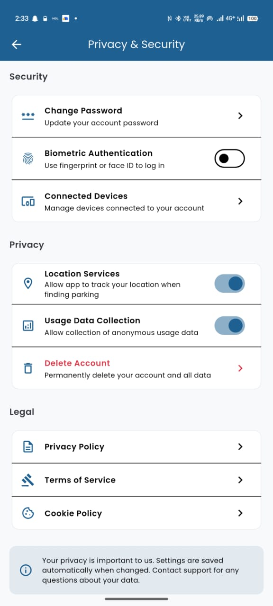
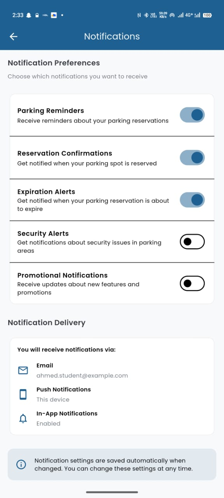
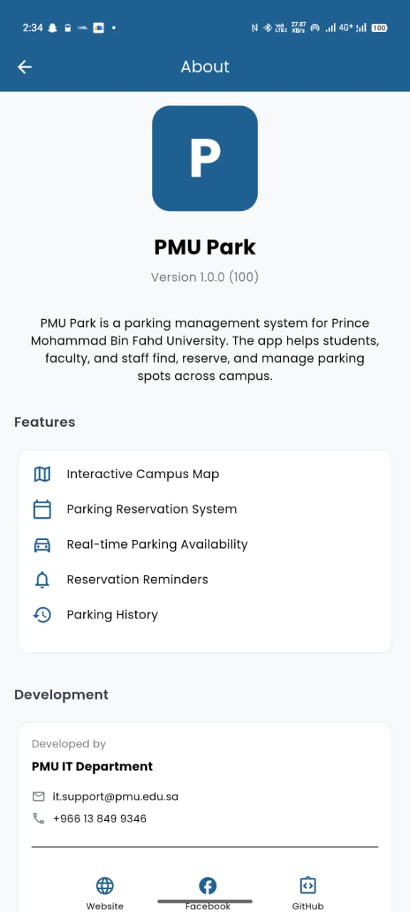
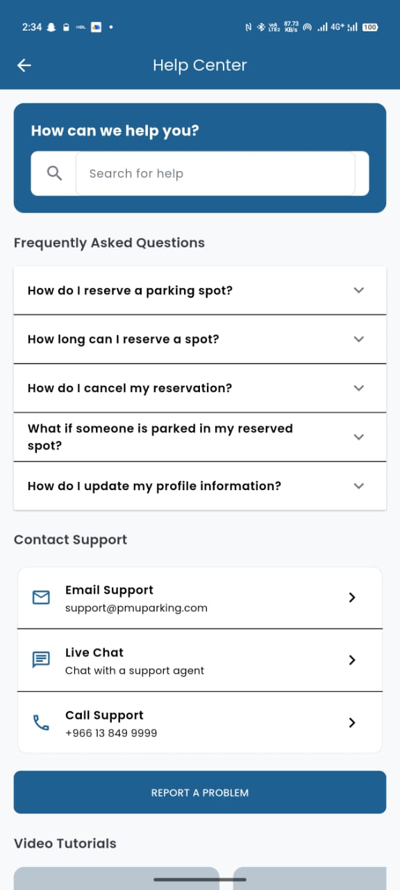
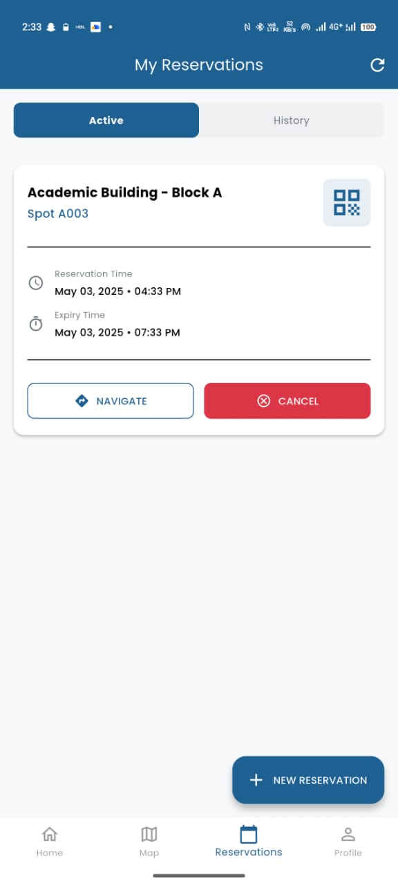
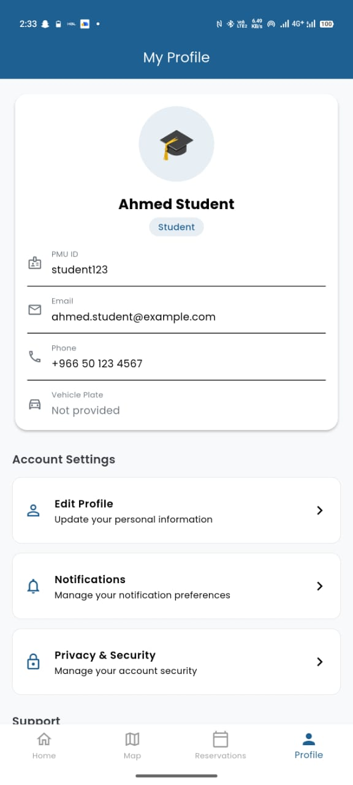
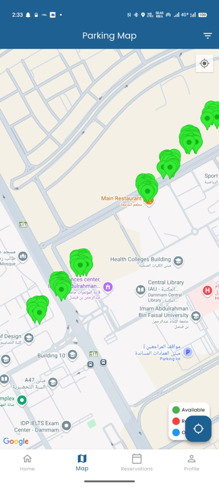

# PMU Parking App


## 📱 Overview

PMU Parking is a mobile application designed for Prince Mohammad Bin Fahd University (PMU) to help students, faculty, and staff efficiently find, reserve, and manage parking spots on campus. The app provides real-time information about parking availability across different zones on campus.

## ✨ Features

- **User Authentication**: Secure login for students, faculty, staff, security personnel, and visitors
- **Real-time Parking Map**: Interactive map showing available parking spots across campus
- **Parking Reservation**: Reserve parking spots in advance for a specified duration
- **Zone-based Permissions**: Designated parking areas based on user type (student, faculty, staff, visitor)
- **Activity History**: Track reservation history and recent parking activities
- **Profile Management**: Update personal information and vehicle details
- **QR Code Integration**: Quick access to parking information
- **Notifications**: Updates about reservations and important information

## 🛠️ Technology Stack

- **Framework**: Flutter (Dart)
- **Backend**: Firebase
  - Authentication: Firebase Auth
  - Database: Cloud Firestore
  - Storage: Firebase Storage
- **Maps**: Google Maps API
- **State Management**: Provider
- **Local Storage**: Shared Preferences

## 📸 Screenshots

<div style="display: flex; flex-wrap: wrap; gap: 10px;">
  
  
  
  
  
  
  
  
  
  
</div>

## 🚀 Getting Started

### Prerequisites

- Flutter SDK (version 3.10.0 or higher)
- Dart SDK (version 3.0.0 or higher)
- Android Studio / VS Code
- Firebase account

### Installation

1. Clone the repository
   ```bash
   git clone https://github.com/yourusername/pmu_parking.git
   cd pmu_parking
   ```

2. Install dependencies
   ```bash
   flutter pub get
   ```

3. Configure Firebase
   - Create a Firebase project in the [Firebase Console](https://console.firebase.google.com/)
   - Add Android and iOS apps to your Firebase project
   - Download and add the configuration files:
     - `android/app/google-services.json` for Android
     - `ios/Runner/GoogleService-Info.plist` for iOS
   - Enable Authentication, Firestore, and Storage services

4. Run the app
   ```bash
   flutter run
   ```

## 🧪 Testing

The app includes demo accounts for testing:

| User Type | ID | Password |
|-----------|------------|----------|
| Student | student123 | password |
| Faculty | faculty123 | password |
| Staff | staff123 | password |
| Security | security123 | password |
| Visitor | visitor123 | password |

## 🤝 Contributing

Contributions are welcome! Please feel free to submit a Pull Request.

1. Fork the repository
2. Create your feature branch (`git checkout -b feature/AmazingFeature`)
3. Commit your changes (`git commit -m 'Add some AmazingFeature'`)
4. Push to the branch (`git push origin feature/AmazingFeature`)
5. Open a Pull Request

## 📄 License

This project is licensed under the MIT License - see the LICENSE file for details.

## 🙏 Acknowledgments

- Prince Mohammad Bin Fahd University for their support
- Flutter and Firebase teams for their excellent documentation
- All contributors who participate in this project

---

Developed for PMU by [Your Name] - May 2025
